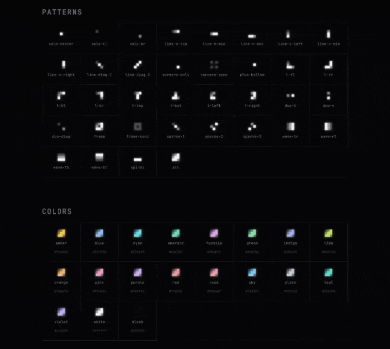

# lumidot

Dot-grid loading animations for React. Tiny, flexible, beautiful.



## Installation

```bash
npm install lumidot
```

## Usage

```tsx
import { Lumidot } from 'lumidot';

function App() {
  return (
    <>
      <Lumidot />
      <Lumidot rows={5} cols={5} pattern="all" />
    </>
  );
}
```

## Props

| Prop        | Type               | Default  | Description                                         |
| ----------- | ------------------ | -------- | --------------------------------------------------- |
| `pattern`   | `LumidotPattern`   | `'all'`  | Dot layout pattern (36 options)                     |
| `variant`   | `LumidotVariant`   | `'blue'` | Color variant (20 options)                          |
| `rows`      | `number`           | `3`      | Number of rows in the dot grid                      |
| `cols`      | `number`           | `3`      | Number of columns in the dot grid                   |
| `direction` | `LumidotDirection` | `'ltr'`  | Wave direction — `'ltr'`, `'rtl'`, `'ttb'`, `'btt'` |
| `scale`     | `number`           | `1`      | Size multiplier (1 = 20px)                          |
| `glow`      | `number`           | `8`      | Glow intensity                                      |
| `duration`  | `number`           | `0.7`    | Wave cycle duration in seconds                      |
| `className` | `string`           | —        | Additional CSS classes                              |
| `style`     | `CSSProperties`    | —        | Inline styles                                       |
| `testId`    | `string`           | —        | Sets `data-testid` attribute                        |

## Patterns

36 named patterns organized by category:

- **Solo** — `solo-center`, `solo-tl`, `solo-br`
- **Lines** — `line-h-top`, `line-h-mid`, `line-h-bot`, `line-v-left`, `line-v-mid`, `line-v-right`, `line-diag-1`, `line-diag-2`
- **Corners & Cross** — `corners-only`, `corners-sync`, `plus-hollow`
- **Shapes** — `l-tl`, `l-tr`, `l-bl`, `l-br`, `t-top`, `t-bot`, `t-left`, `t-right`
- **Duo** — `duo-h`, `duo-v`, `duo-diag`
- **Frame** — `frame`, `frame-sync`
- **Sparse** — `sparse-1`, `sparse-2`, `sparse-3`
- **Wave** — `wave-lr`, `wave-rl`, `wave-tb`, `wave-bt`
- **Other** — `spiral`, `all`

## Variants

20 color variants: `amber`, `black`, `blue`, `cyan`, `emerald`, `fuchsia`, `green`, `indigo`, `lime`, `orange`, `pink`, `purple`, `red`, `rose`, `sky`, `slate`, `teal`, `violet`, `white`, `yellow`

## Animation Modes

The animation mode is determined automatically by the pattern:

- **Wave** — Continuous pulsing animation across the grid. Controlled by `duration` and `direction`.
- **Sequence** — Frame-by-frame animation for multi-frame patterns (`corners-only`, `plus-hollow`, `spiral`).

## Accessibility

- Respects `prefers-reduced-motion` — animations are disabled when the user prefers reduced motion

## License

MIT
