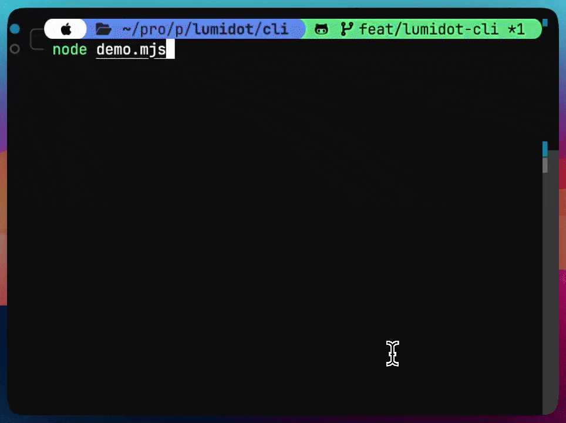

# lumiterm

Dot-grid terminal loader with wave, spiral, and frame animations. Renders using braille characters with automatic ASCII fallback.



## Install

```
npm install lumiterm
```

## Usage

```js
import { lumiterm } from 'lumiterm';

const loader = lumiterm({ pattern: 'wave-lr', color: 'cyan' });

loader.start('Loading...');

// update text while running
loader.text = 'Almost done...';

// finish with a status
loader.succeed('Done');
```

Or pass a string shorthand:

```js
const loader = lumiterm('Loading...');
loader.start();
```

## Options

| Option | Type | Default | Description |
|--------|------|---------|-------------|
| `pattern` | `string` | `'wave-lr'` | Animation pattern |
| `color` | `string \| function` | `'blue'` | Any named color, hex (`'#FF8800'`), rgb (`'rgb(255,136,0)'`), or chalk function |
| `text` | `string` | `''` | Text displayed next to the loader |
| `rows` | `number` | `4` | Dot grid height |
| `cols` | `number` | `4` | Dot grid width |
| `stream` | `WriteStream` | `process.stderr` | Output stream |

## API

### `lumiterm(options?)`

Creates a new `Lumiterm` instance. Accepts an options object or a string (used as `text`).

### Instance methods

```js
loader.start(text?)    // start the animation
loader.stop()          // stop and clear output
loader.succeed(text?)  // stop with green checkmark
loader.fail(text?)     // stop with red cross
loader.warn(text?)     // stop with yellow warning
loader.info(text?)     // stop with blue info symbol
loader.frame()         // returns { output, lineCount } without writing to stream
```

### Instance properties

```js
loader.text            // get/set display text
loader.color           // get/set color
loader.pattern         // get/set pattern (resets animation)
loader.isSpinning      // read-only
```

## Colors

Pass any format you like:

```js
loader.color = 'cyan';           // named
loader.color = '#FF8800';        // hex
loader.color = 'rgb(255,136,0)'; // rgb
```

## Patterns

36 built-in patterns organized by category:

**Solo** &mdash; `solo-center`, `solo-tl`, `solo-br`

**Lines** &mdash; `line-h-top`, `line-h-mid`, `line-h-bot`, `line-v-left`, `line-v-mid`, `line-v-right`, `line-diag-1`, `line-diag-2`

**Corners & shapes** &mdash; `corners-only`, `corners-sync`, `plus-hollow`

**L-shapes** &mdash; `l-tl`, `l-tr`, `l-bl`, `l-br`

**T-shapes** &mdash; `t-top`, `t-bot`, `t-left`, `t-right`

**Duos** &mdash; `duo-h`, `duo-v`, `duo-diag`

**Frames** &mdash; `frame`, `frame-sync`

**Sparse** &mdash; `sparse-1`, `sparse-2`, `sparse-3`

**Waves** &mdash; `wave-lr`, `wave-rl`, `wave-tb`, `wave-bt`

**Other** &mdash; `spiral`, `all`

## Related

- [lumidot](https://www.npmjs.com/package/lumidot) — Same dot-grid animations for React

## License

MIT
